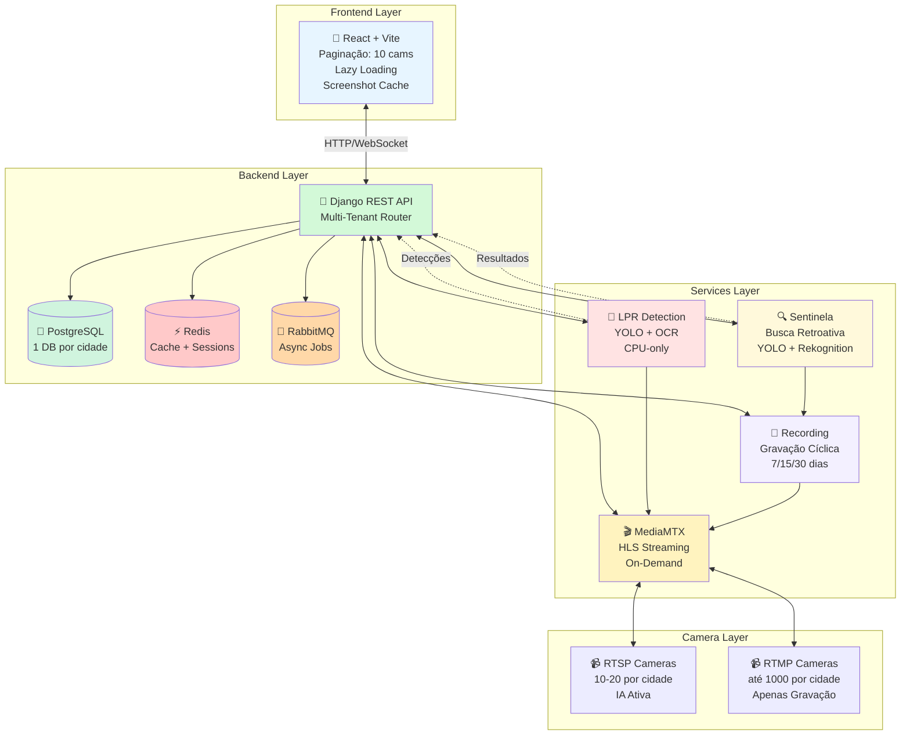

# 📹 VMS - Sistema de Monitoramento com IA

Sistema de monitoramento de vídeo com detecção de placas veiculares (LPR) e busca retroativa em gravações.

> **Multi-Tenant:** 1 banco por cidade | **Usuários transferíveis** entre cidades | **IA Dupla:** YOLO + Rekognition

---

## 🚀 Quick Start

```bash
# 1. Clone o repositório
git clone <repo-url>
cd VMS

# 2. Configure variáveis de ambiente
cp .env.example .env

# 3. Inicie os serviços
docker-compose up -d

# 4. Acesse
Frontend: http://localhost:5173
Backend: http://localhost:8000
Prometheus: http://localhost:9090
```

---

## 📋 Documentação

### Principal
- **[📚 Índice Completo](docs/INDEX.md)** - Toda documentação organizada
- **[🚀 Roadmap de Fases](docs/phases/README.md)** - Desenvolvimento por sprints
- **[📊 Visão Geral do Sistema](docs/SYSTEM_OVERVIEW.md)** - Arquitetura completa
- **[🛠️ Stack Tecnológica](docs/TECH_STACK.md)** - Tecnologias e justificativas
- **[⚡ Performance](docs/performance/PERFORMANCE.md)** - Otimizações implementadas
- **[💰 Cost Optimization](docs/cost-optimization/COST_OPTIMIZATION.md)** - Economia de $531k/mês

### Por Componente
- **[🎥 Streaming](docs/streaming/STREAMING.md)** - MediaMTX + HLS + Thumbnails
- **[🤖 LPR Detection](docs/detection/LPR.md)** - YOLO + OCR
- **[📄 Paginação](docs/performance/PAGINATION.md)** - 10 câmeras por página

### Para Desenvolvedores
- **[📝 Regras de Desenvolvimento](.amazonq/prompts/development-rules.md)** - Workflow obrigatório
- **[📋 Template de Task](docs/TASK_TEMPLATE.md)** - Documentação estruturada

---

## 🏗️ Arquitetura



### Fluxo de Dados

1. **Streaming:** Câmera → MediaMTX → HLS → Frontend (com cache após 10s)
2. **Detecção:** RTSP → LPR (YOLO+OCR) → Backend → Frontend
3. **Gravação:** MediaMTX → Recording Service → Storage (cíclico)
4. **Busca:** Usuário → Sentinela → Gravações → IA → Resultados

---

## 📹 Tipos de Câmeras

### RTSP (LPR) - Alta Definição
- **Protocolo**: `rtsp://`
- **Quantidade**: 10-20 por cidade
- **IA**: ✅ Ativa (YOLO + OCR)
- **Gravação**: ✅ Contínua

### RTMP (Bullets) - Padrão
- **Protocolo**: `rtmp://`
- **Quantidade**: até 1000 por cidade
- **IA**: ❌ Desativada
- **Gravação**: ✅ Contínua

---

## 💾 Sistema de Armazenamento

### Gravação Cíclica

| Plano | Dias | Usuários | Diferencial |
|-------|------|----------|-------------|
| Basic | 7    | 3        | -           |
| Pro   | 15   | 5        | -           |
| Premium | 30 | 10       | Relatórios  |

### Clipes Permanentes
- Usuário cria clipe de gravação
- Clipe **não é deletado** no ciclo
- Armazenamento permanente

---

## 🔍 Sentinela (Busca Retroativa)

Busca em gravações (não tempo real):
- 🚗 Veículos: cor, tipo, marca
- 🔢 Placas: OCR
- 📅 Por data e câmera
- ⏱️ Resultados com timestamp

---

## 🛠️ Stack Tecnológica

### Backend
- Django 4.2
- PostgreSQL 15
- Redis 7
- RabbitMQ 3.13

### Frontend
- React 18
- Vite 5
- TailwindCSS
- TypeScript

### Streaming
- MediaMTX (HLS)
- FFmpeg

### IA
- YOLOv8n (detecção)
- Fast-Plate-OCR (reconhecimento)
- PyTorch (CPU-only)
- AWS Rekognition (opcional)

### Infraestrutura
- Docker Compose
- Prometheus

---

## 📊 Status do Projeto

### ✅ Fase 0: Base Implementada
- [x] Streaming (MediaMTX + HLS)
- [x] Backend API (Django + PostgreSQL + Redis + RabbitMQ)
- [x] Frontend (React + Vite + TypeScript + TailwindCSS)
- [x] LPR Detection (YOLO + OCR, CPU-only)
- [x] Paginação (10 câmeras/página)
- [x] Lazy Loading (Intersection Observer)
- [x] Screenshot Cache (10s streaming → imagem estática)
- [x] Monitoring (Prometheus)
- [x] Docker Compose completo

### 🔄 Sprint 3: Recording & Playback (Em Andamento)
- [ ] **Multi-Tenant + Planos** (BLOQUEANTE)
- [ ] Recording Service
- [ ] Playback API
- [ ] Timeline Component
- [ ] Clip System

### 📋 Próximas Fases
- **Fase 1:** Dashboard de Detecções
- **Fase 2:** Sistema de Blacklist
- **Fase 4:** Sentinela - Busca Retroativa
- **Fase 6:** Analytics & Relatórios

Ver [Roadmap Completo](docs/phases/README.md)

---

## ⚡ Otimizações Implementadas

### Performance
- **Paginação:** 10 câmeras por página (99% menos componentes renderizados)
- **Lazy Loading:** Só carrega câmeras visíveis (90% economia de requisições)
- **Screenshot Cache:** 10s streaming → imagem estática (95% economia de banda)
- **Frame Skipping:** Processa 1 a cada 3 frames na IA (66% economia de CPU)

### Custos
- **Banda:** $5k/mês (vs $520k sem otimização) - **99% economia**
- **CPU:** $500/mês (vs $10k com GPU) - **95% economia**
- **Storage:** $250/mês (vs $6k sem compressão) - **96% economia**
- **Total:** $6,150/mês (vs $538k) - **$531,850/mês economizado**

Ver [Documentação Completa de Performance](docs/performance/PERFORMANCE.md)

---

## 🧪 Testes

```bash
# Testar tudo
docker-compose up -d
docker-compose ps  # Verificar health

# Testar componente específico
docker-compose up -d backend postgres_db
curl http://localhost:8000/health

# Logs
docker-compose logs -f [service]

# Restart
docker-compose restart [service]
```

---

## 📦 Estrutura do Projeto

```
VMS/
├── backend/              # Django API
├── frontend/             # React + Vite
├── services/
│   ├── lpr_detection/   # YOLO + OCR
│   ├── streaming/       # MediaMTX integration
│   └── recording/       # Gravação cíclica
├── docs/                # Documentação
│   ├── phases/          # Roadmap por fase
│   ├── streaming/       # Docs de streaming
│   ├── detection/       # Docs de IA
│   ├── performance/     # Otimizações
│   └── cost-optimization/  # Economia
├── .amazonq/
│   └── prompts/         # Regras de desenvolvimento
└── docker-compose.yml   # Orquestração
```

---

## 🔧 Configuração

### Variáveis de Ambiente

```bash
# Backend
POSTGRES_USER=vms_user
POSTGRES_PASSWORD=secure_password
POSTGRES_DB=vms_db

# LPR Detection
ADMIN_API_KEY=your_api_key

# MediaMTX
MEDIAMTX_API_USER=mediamtx_api_user
MEDIAMTX_API_PASS=secure_password
```

Ver `.env.example` para lista completa.

---

## 📝 Desenvolvimento

### Workflow
1. Ler [Regras de Desenvolvimento](.amazonq/prompts/development-rules.md)
2. Escolher task do [Roadmap](docs/phases/README.md)
3. Implementar com código mínimo
4. Testar com `docker-compose`
5. Marcar task como concluída [x]
6. Criar documentação completa usando [Template](docs/TASK_TEMPLATE.md)

### Estrutura de Documentação por Task
```
docs/phases/[FASE]/[TASK_NAME]/
├── WHAT.md           # O que foi feito
├── WHY.md            # Por que (alternativas, trade-offs)
├── IMPACT.md         # Impacto (benefícios, métricas)
├── METRICS.md        # Cálculos (DAU, RPS, custos)
├── IMPORTANCE.md     # Quando usar/não usar
└── diagram.excalidraw.json  # Diagrama visual
```

---

## 📄 Licença

[Definir licença]

---

## 🔗 Links Úteis

### Documentação
- [📚 Índice Completo](docs/INDEX.md)
- [🚀 Roadmap de Fases](docs/phases/README.md)
- [📊 Visão Geral](docs/SYSTEM_OVERVIEW.md)
- [🛠️ Stack Tecnológica](docs/TECH_STACK.md)
- [⚡ Performance](docs/performance/PERFORMANCE.md)
- [💰 Cost Optimization](docs/cost-optimization/COST_OPTIMIZATION.md)

### Diagramas
- [Arquitetura de Streaming](docs/streaming/streaming-architecture.excalidraw.json)
- [Otimização de Thumbnails](docs/streaming/thumbnail-optimization.excalidraw.json)
- [Pipeline LPR](docs/detection/lpr-pipeline.excalidraw.json)
- [Otimizações de Performance](docs/performance/performance-optimizations.excalidraw.json)
- [Economia de Custos](docs/cost-optimization/cost-savings.excalidraw.json)
- [Arquitetura Geral](docs/system-architecture.excalidraw.json)

### Tecnologias
- [MediaMTX Docs](https://github.com/bluenviron/mediamtx)
- [YOLOv8 Docs](https://docs.ultralytics.com/)
- [Django Docs](https://docs.djangoproject.com/)
- [React Docs](https://react.dev/)
- [HLS.js Docs](https://github.com/video-dev/hls.js/)
