# 📹 VMS — Fluxo do Serviço de Streaming

## Diagrama de Sequência: Provisionamento e Visualização de Câmera

```mermaid
sequenceDiagram
    participant U as 👤 Usuário
    participant F as Frontend (React)
    participant H as HAProxy :80
    participant K as Kong Gateway
    participant B as Backend (Django)
    participant S as Streaming Service
    participant M as MediaMTX
    participant C as 📹 Câmera IP

    Note over U,C: 1️⃣ PROVISIONAMENTO DE CÂMERA
    
    U->>F: Criar nova câmera
    F->>H: POST /api/cameras/
    H->>K: Rotear para API
    K->>B: {name, stream_url, location}
    B->>B: Salvar no PostgreSQL
    B->>B: Gerar camera_id
    
    B->>S: POST /cameras/provision
    Note right of B: {camera_id, rtsp_url, name}
    
    S->>S: ProvisionStreamHandler.handle()
    S->>S: Criar Stream entity
    S->>S: Gerar path: "cam_{id}"
    S->>S: Salvar no repository
    
    S->>M: POST /v3/config/paths/add/cam_2
    Note right of S: {source: rtsp_url, sourceOnDemand: true}
    M->>M: Adicionar path na config
    M->>S: 200 OK
    
    S->>B: 200 {stream_path, hls_url}
    B->>K: 201 Camera Created
    K->>H: Response
    H->>F: Camera data
    F->>U: ✅ Câmera criada

    Note over U,C: 2️⃣ VISUALIZAÇÃO AO VIVO
    
    U->>F: Clicar para visualizar
    F->>F: Gerar URL HLS
    Note right of F: /hls/cam_2/index.m3u8
    
    F->>H: GET /hls/cam_2/index.m3u8
    H->>H: Match ACL /hls/*
    H->>M: Forward (strip /hls/)
    Note right of H: GET /cam_2/index.m3u8
    
    alt Stream On-Demand (primeira visualização)
        M->>M: Path existe mas não conectado
        M->>C: RTSP DESCRIBE
        C->>M: 200 OK + SDP
        M->>C: RTSP SETUP
        C->>M: 200 OK
        M->>C: RTSP PLAY
        C->>M: Iniciar stream RTSP
        M->>M: Transcodificar para HLS
    end
    
    M->>H: 200 + index.m3u8
    H->>F: HLS manifest
    F->>F: HLS.js carregar playlist
    
    Note over U,C: 3️⃣ STREAMING CONTÍNUO
    
    loop A cada 4 segundos
        F->>H: GET /hls/cam_2/seg_N.mp4
        H->>M: Forward segment
        M->>M: Ler do buffer
        M->>H: Video segment
        H->>F: MP4 segment
        F->>F: HLS.js reproduzir
    end
    
    C->>M: Pacotes RTSP (contínuo)
    M->>M: Buffer & segmentar
    
    Note over U,C: 4️⃣ ENCERRAMENTO
    
    U->>F: Fechar player
    F->>F: Parar requisições
    M->>M: Aguardar 30s sem viewers
    M->>C: RTSP TEARDOWN
    C->>M: 200 OK
    M->>M: Liberar recursos
```



## Componentes e Responsabilidades

### 🎯 Streaming Service (FastAPI)
- **Provisionar câmeras**: Criar entidade Stream e registrar no MediaMTX
- **Gerenciar paths**: Adicionar/remover paths via API do MediaMTX
- **Status**: Consultar estado dos streams

### 📡 MediaMTX
- **Conectar RTSP**: Estabelecer conexão com câmeras IP
- **Transcodificar**: Converter RTSP para HLS (H.264 → fMP4)
- **Servir HLS**: Gerar playlists e segmentos de vídeo
- **On-Demand**: Conectar apenas quando há viewers

### 🔀 HAProxy
- **Roteamento direto**: `/hls/*` → MediaMTX (bypass Kong)
- **Baixa latência**: Sem overhead de gateway
- **Path rewrite**: Remover prefixo `/hls/`

### 🎨 Frontend (React + HLS.js)
- **Player**: Reproduzir streams HLS
- **Auto-recovery**: Reconectar em caso de erro
- **Buffer**: 5s para estabilidade

## Fluxo de Dados

```
Câmera RTSP → MediaMTX → HAProxy → Frontend
   (H.264)      (HLS/fMP4)   (Proxy)   (HLS.js)
```

## Configurações Críticas

### MediaMTX (mediamtx.yml)
```yaml
hls: yes
hlsAddress: :8888
hlsSegmentDuration: 4s
hlsSegmentCount: 6
hlsMuxerCloseAfter: 30s

pathDefaults:
  sourceOnDemand: yes
  sourceOnDemandCloseAfter: 15s
  maxReaders: 8
```

### HAProxy (haproxy.cfg)
```
acl is_hls path_beg /hls/
use_backend mediamtx_hls if is_hls

backend mediamtx_hls
    http-request replace-path /hls/(.*) /\1
    server mediamtx1 mediamtx:8888
```

### Frontend (HLS.js)
```typescript
const hls = new Hls({
  maxBufferLength: 5,
  maxBufferSize: 5 * 1000 * 1000
})
hls.loadSource(`/hls/cam_${cameraId}/index.m3u8`)
```

## Latência Total: ~10-15s

| Etapa | Tempo |
|-------|-------|
| RTSP → MediaMTX | 100-500ms |
| Segmentação HLS | 4s |
| Rede | 50-200ms |
| Buffer cliente | 5s |
| **Total** | **~10-15s** |

## Limites MVP

- ✅ Até 4 câmeras simultâneas por usuário
- ✅ Até 8 viewers por stream
- ✅ On-demand para economia de recursos
- ✅ Sem gravação (apenas live)
