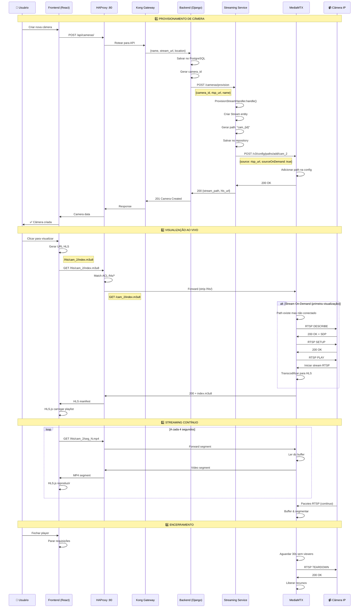

# 📹 VMS — Fluxo do Serviço de Streaming

## Diagrama de Sequência: Provisionamento e Visualização de Câmera



## Componentes e Responsabilidades

### 🎯 Streaming Service (FastAPI)
- **Provisionar câmeras**: Criar entidade Stream e registrar no MediaMTX
- **Gerenciar paths**: Adicionar/remover paths via API do MediaMTX
- **Status**: Consultar estado dos streams

### 📡 MediaMTX
- **Conectar RTSP**: Estabelecer conexão com câmeras IP
- **Transcodificar**: Converter RTSP para HLS (H.264 → fMP4)
- **Servir HLS**: Gerar playlists e segmentos de vídeo
- **On-Demand**: Conectar apenas quando há viewers

### 🔀 HAProxy
- **Roteamento direto**: `/hls/*` → MediaMTX (bypass Kong)
- **Baixa latência**: Sem overhead de gateway
- **Path rewrite**: Remover prefixo `/hls/`

### 🎨 Frontend (React + HLS.js)
- **Player**: Reproduzir streams HLS
- **Auto-recovery**: Reconectar em caso de erro
- **Buffer**: 5s para estabilidade

## Fluxo de Dados

```
Câmera RTSP → MediaMTX → HAProxy → Frontend
   (H.264)      (HLS/fMP4)   (Proxy)   (HLS.js)
```

## Configurações Críticas

### MediaMTX (mediamtx.yml)
```yaml
hls: yes
hlsAddress: :8888
hlsSegmentDuration: 4s
hlsSegmentCount: 6
hlsMuxerCloseAfter: 30s

pathDefaults:
  sourceOnDemand: yes
  sourceOnDemandCloseAfter: 15s
  maxReaders: 8
```

### HAProxy (haproxy.cfg)
```
acl is_hls path_beg /hls/
use_backend mediamtx_hls if is_hls

backend mediamtx_hls
    http-request replace-path /hls/(.*) /\1
    server mediamtx1 mediamtx:8888
```

### Frontend (HLS.js)
```typescript
const hls = new Hls({
  maxBufferLength: 5,
  maxBufferSize: 5 * 1000 * 1000
})
hls.loadSource(`/hls/cam_${cameraId}/index.m3u8`)
```

## Latência Total: ~10-15s

| Etapa | Tempo |
|-------|-------|
| RTSP → MediaMTX | 100-500ms |
| Segmentação HLS | 4s |
| Rede | 50-200ms |
| Buffer cliente | 5s |
| **Total** | **~10-15s** |

## Limites MVP

- ✅ Até 4 câmeras simultâneas por usuário
- ✅ Até 8 viewers por stream
- ✅ On-demand para economia de recursos
- ✅ Sem gravação (apenas live)
