# VMS — AI Detection Flow

## Complete AI Detection Pipeline

```mermaid
graph TB
    subgraph "Video Source"
        Camera[📹 IP Camera<br/>RTSP Stream]
        MediaMTX[MediaMTX<br/>HLS Server]
    end

    subgraph "AI Detection Service :8002"
        FrameExtractor[Frame Extractor<br/>1 FPS]
        Preprocessor[Image Preprocessor<br/>Resize + Normalize]
        YOLOv8[YOLOv8 Model<br/>License Plate Detection]
        PostProcessor[Post Processor<br/>Filter + Validate]
        ROIFilter[ROI Filter<br/>Region of Interest]
    end

    subgraph "Data Storage"
        Postgres[(PostgreSQL<br/>Detections Table)]
        Redis[(Redis Cache<br/>Recent Detections)]
    end

    subgraph "Event System"
        RabbitMQ[RabbitMQ<br/>Event Queue]
        Backend[Django Backend<br/>Event Consumer]
    end

    subgraph "Frontend"
        Dashboard[Dashboard<br/>Real-time Updates]
        DetectionList[Detection List<br/>History View]
    end

    Camera -->|RTSP| MediaMTX
    MediaMTX -->|HLS Stream| FrameExtractor
    FrameExtractor -->|1 Frame/sec| Preprocessor
    Preprocessor -->|640x640 Image| YOLOv8
    YOLOv8 -->|Bounding Boxes| PostProcessor
    PostProcessor -->|Confidence > 0.5| ROIFilter
    ROIFilter -->|Valid Detections| Postgres
    ROIFilter -->|Cache| Redis
    ROIFilter -->|Publish Event| RabbitMQ
    RabbitMQ -->|Consume| Backend
    Backend -->|WebSocket| Dashboard
    Postgres -->|Query| DetectionList

    style Camera fill:#fff9c4
    style MediaMTX fill:#f3e5f5
    style YOLOv8 fill:#e8f5e9
    style Postgres fill:#fce4ec
    style Redis fill:#fce4ec
    style RabbitMQ fill:#fce4ec
    style Dashboard fill:#e1f5ff
```



## AI Service Architecture (DDD)


## Detection Flow Sequence


## Frame Extraction Process

### 1. HLS Segment Download

```python
# Pseudo-code
class FrameExtractor:
    def __init__(self, camera_id: int):
        self.hls_url = f"http://mediamtx:8888/cam_{camera_id}/index.m3u8"
        self.last_segment = None
    
    async def get_latest_frame(self) -> np.ndarray:
        # Parse HLS playlist
        playlist = await self.fetch_playlist()
        latest_segment = playlist.segments[-1]
        
        # Skip if already processed
        if latest_segment == self.last_segment:
            return None
        
        # Download segment
        segment_data = await self.download_segment(latest_segment)
        
        # Extract middle frame
        frame = self.extract_frame(segment_data, position=0.5)
        
        self.last_segment = latest_segment
        return frame
    
    def extract_frame(self, segment_data: bytes, position: float) -> np.ndarray:
        # Use OpenCV to extract frame
        cap = cv2.VideoCapture(io.BytesIO(segment_data))
        
        # Seek to position (0.5 = middle of segment)
        total_frames = int(cap.get(cv2.CAP_PROP_FRAME_COUNT))
        target_frame = int(total_frames * position)
        cap.set(cv2.CAP_PROP_POS_FRAMES, target_frame)
        
        ret, frame = cap.read()
        cap.release()
        
        return frame if ret else None
```

### 2. Image Preprocessing

```python
class ImagePreprocessor:
    def __init__(self):
        self.target_size = (640, 640)  # YOLOv8 input size
    
    def preprocess(self, frame: np.ndarray) -> np.ndarray:
        # Resize maintaining aspect ratio
        h, w = frame.shape[:2]
        scale = min(640 / w, 640 / h)
        new_w, new_h = int(w * scale), int(h * scale)
        
        resized = cv2.resize(frame, (new_w, new_h))
        
        # Pad to 640x640
        padded = np.zeros((640, 640, 3), dtype=np.uint8)
        y_offset = (640 - new_h) // 2
        x_offset = (640 - new_w) // 2
        padded[y_offset:y_offset+new_h, x_offset:x_offset+new_w] = resized
        
        # Normalize to [0, 1]
        normalized = padded.astype(np.float32) / 255.0
        
        # Convert to CHW format (channels first)
        transposed = np.transpose(normalized, (2, 0, 1))
        
        return transposed
```

## YOLOv8 Detection

### Model Architecture

```
Input: 640x640x3 RGB Image
    ↓
Backbone: CSPDarknet53
    ↓
Neck: PANet
    ↓
Head: Detection Head
    ↓
Output: Bounding Boxes + Classes + Confidence
```

### Detection Process

```python
class YOLOv8Detector:
    def __init__(self, model_path: str = "yolov8n.pt"):
        self.model = YOLO(model_path)
        self.classes = ["license_plate", "vehicle"]
    
    def detect(self, image: np.ndarray) -> List[Detection]:
        # Run inference
        results = self.model(image, conf=0.5, iou=0.45)
        
        detections = []
        for result in results:
            boxes = result.boxes
            
            for box in boxes:
                detection = Detection(
                    class_id=int(box.cls),
                    class_name=self.classes[int(box.cls)],
                    confidence=float(box.conf),
                    bbox=box.xyxy[0].tolist(),  # [x1, y1, x2, y2]
                    timestamp=datetime.now()
                )
                detections.append(detection)
        
        return detections
```

### Bounding Box Format

```
Image: 640x640 pixels

Detection:
  class: "license_plate"
  confidence: 0.87
  bbox: [120, 200, 280, 250]
         ↑    ↑    ↑    ↑
         x1   y1   x2   y2
  
Visual:
  (120, 200) ┌─────────┐
             │ ABC-1234│
             └─────────┘ (280, 250)
```

## ROI (Region of Interest) Filtering

### ROI Configuration

```json
{
  "camera_id": 2,
  "roi_areas": [
    {
      "name": "Entrance Gate",
      "points": [
        {"x": 100, "y": 100},
        {"x": 500, "y": 100},
        {"x": 500, "y": 400},
        {"x": 100, "y": 400}
      ],
      "enabled": true
    }
  ]
}
```

### ROI Validation

```python
class ROIFilter:
    def __init__(self, roi_areas: List[ROIArea]):
        self.roi_areas = roi_areas
    
    def is_inside_roi(self, bbox: List[float]) -> bool:
        if not self.roi_areas:
            return True  # No ROI = accept all
        
        # Calculate center point of bounding box
        x1, y1, x2, y2 = bbox
        center_x = (x1 + x2) / 2
        center_y = (y1 + y2) / 2
        
        # Check if center is inside any ROI polygon
        for roi in self.roi_areas:
            if not roi.enabled:
                continue
            
            if self.point_in_polygon(center_x, center_y, roi.points):
                return True
        
        return False
    
    def point_in_polygon(self, x: float, y: float, polygon: List[Point]) -> bool:
        # Ray casting algorithm
        inside = False
        n = len(polygon)
        
        for i in range(n):
            j = (i + 1) % n
            xi, yi = polygon[i].x, polygon[i].y
            xj, yj = polygon[j].x, polygon[j].y
            
            if ((yi > y) != (yj > y)) and \
               (x < (xj - xi) * (y - yi) / (yj - yi) + xi):
                inside = not inside
        
        return inside
```

## License Plate Recognition (OCR)

### Text Extraction

```python
import easyocr

class LicensePlateOCR:
    def __init__(self):
        self.reader = easyocr.Reader(['en', 'pt'])
    
    def extract_text(self, image: np.ndarray, bbox: List[float]) -> str:
        # Crop license plate region
        x1, y1, x2, y2 = map(int, bbox)
        plate_img = image[y1:y2, x1:x2]
        
        # Enhance image
        gray = cv2.cvtColor(plate_img, cv2.COLOR_BGR2GRAY)
        enhanced = cv2.equalizeHist(gray)
        
        # Run OCR
        results = self.reader.readtext(enhanced)
        
        if not results:
            return ""
        
        # Get text with highest confidence
        text = max(results, key=lambda x: x[2])[1]
        
        # Clean text (remove spaces, special chars)
        cleaned = self.clean_plate_text(text)
        
        return cleaned
    
    def clean_plate_text(self, text: str) -> str:
        # Remove spaces and special characters
        cleaned = ''.join(c for c in text if c.isalnum())
        
        # Convert to uppercase
        cleaned = cleaned.upper()
        
        # Validate format (Brazilian: ABC1234 or ABC1D23)
        if self.is_valid_brazilian_plate(cleaned):
            return cleaned
        
        return text  # Return original if invalid
    
    def is_valid_brazilian_plate(self, text: str) -> bool:
        # Old format: ABC1234 (3 letters + 4 numbers)
        # New format: ABC1D23 (3 letters + 1 number + 1 letter + 2 numbers)
        import re
        
        old_pattern = r'^[A-Z]{3}\d{4}$'
        new_pattern = r'^[A-Z]{3}\d[A-Z]\d{2}$'
        
        return bool(re.match(old_pattern, text) or re.match(new_pattern, text))
```

## Detection Storage

### Database Schema

```sql
CREATE TABLE detections (
    id SERIAL PRIMARY KEY,
    camera_id INTEGER NOT NULL REFERENCES cameras(id),
    timestamp TIMESTAMP NOT NULL DEFAULT NOW(),
    
    -- Detection data
    class_name VARCHAR(50) NOT NULL,  -- 'license_plate', 'vehicle'
    confidence FLOAT NOT NULL,         -- 0.0 to 1.0
    
    -- Bounding box
    bbox_x1 FLOAT NOT NULL,
    bbox_y1 FLOAT NOT NULL,
    bbox_x2 FLOAT NOT NULL,
    bbox_y2 FLOAT NOT NULL,
    
    -- License plate specific
    plate_text VARCHAR(20),
    plate_confidence FLOAT,
    
    -- Vehicle specific
    vehicle_type VARCHAR(50),          -- 'car', 'truck', 'motorcycle'
    vehicle_color VARCHAR(50),
    
    -- Metadata
    frame_url TEXT,                    -- URL to saved frame image
    processed BOOLEAN DEFAULT FALSE,
    
    INDEX idx_camera_timestamp (camera_id, timestamp),
    INDEX idx_plate_text (plate_text),
    INDEX idx_timestamp (timestamp)
);
```

### Save Detection

```python
class DetectionRepository:
    def __init__(self, db_connection):
        self.db = db_connection
    
    async def save(self, detection: Detection) -> int:
        query = """
            INSERT INTO detections (
                camera_id, timestamp, class_name, confidence,
                bbox_x1, bbox_y1, bbox_x2, bbox_y2,
                plate_text, plate_confidence
            ) VALUES ($1, $2, $3, $4, $5, $6, $7, $8, $9, $10)
            RETURNING id
        """
        
        result = await self.db.fetchrow(
            query,
            detection.camera_id,
            detection.timestamp,
            detection.class_name,
            detection.confidence,
            detection.bbox[0],
            detection.bbox[1],
            detection.bbox[2],
            detection.bbox[3],
            detection.plate_text,
            detection.plate_confidence
        )
        
        return result['id']
```

## Event Publishing

### RabbitMQ Message Format

```json
{
  "event_type": "detection.created",
  "timestamp": "2026-01-08T10:30:45.123Z",
  "camera_id": 2,
  "detection": {
    "id": 12345,
    "class": "license_plate",
    "confidence": 0.87,
    "plate_text": "ABC1234",
    "bbox": [120, 200, 280, 250],
    "frame_url": "/media/detections/cam_2_20260108_103045.jpg"
  }
}
```

### Publisher

```python
import aio_pika

class EventPublisher:
    def __init__(self, rabbitmq_url: str):
        self.url = rabbitmq_url
        self.connection = None
        self.channel = None
    
    async def connect(self):
        self.connection = await aio_pika.connect_robust(self.url)
        self.channel = await self.connection.channel()
        
        # Declare exchange
        self.exchange = await self.channel.declare_exchange(
            'vms.events',
            aio_pika.ExchangeType.TOPIC,
            durable=True
        )
    
    async def publish_detection(self, detection: Detection):
        message = {
            "event_type": "detection.created",
            "timestamp": detection.timestamp.isoformat(),
            "camera_id": detection.camera_id,
            "detection": detection.to_dict()
        }
        
        await self.exchange.publish(
            aio_pika.Message(
                body=json.dumps(message).encode(),
                content_type='application/json',
                delivery_mode=aio_pika.DeliveryMode.PERSISTENT
            ),
            routing_key=f'detection.camera.{detection.camera_id}'
        )
```

## Performance Optimization

### 1. Economic Mode (1 FPS)

```python
class EconomicDetector:
    def __init__(self):
        self.fps = 1  # Process 1 frame per second
        self.interval = 1.0 / self.fps
    
    async def run(self):
        while self.running:
            start_time = time.time()
            
            # Extract and process frame
            frame = await self.extract_frame()
            if frame is not None:
                detections = await self.detect(frame)
                await self.save_detections(detections)
            
            # Sleep to maintain 1 FPS
            elapsed = time.time() - start_time
            sleep_time = max(0, self.interval - elapsed)
            await asyncio.sleep(sleep_time)
```

**Why 1 FPS?**
- ✅ Reduces CPU usage by 96% (vs 25 FPS)
- ✅ Sufficient for license plate capture
- ✅ Allows multiple cameras simultaneously
- ✅ Lower memory usage

### 2. Batch Processing

```python
class BatchDetector:
    def __init__(self, batch_size: int = 4):
        self.batch_size = batch_size
        self.frame_queue = asyncio.Queue()
    
    async def process_batch(self):
        batch = []
        
        # Collect frames
        for _ in range(self.batch_size):
            try:
                frame = await asyncio.wait_for(
                    self.frame_queue.get(),
                    timeout=1.0
                )
                batch.append(frame)
            except asyncio.TimeoutError:
                break
        
        if not batch:
            return
        
        # Process all frames at once (GPU optimization)
        results = self.model(batch)
        
        # Save results
        for frame, result in zip(batch, results):
            await self.save_detections(result)
```

### 3. Model Optimization

```python
# Use smaller YOLOv8 variant
model = YOLO("yolov8n.pt")  # Nano (fastest)
# vs
# model = YOLO("yolov8s.pt")  # Small
# model = YOLO("yolov8m.pt")  # Medium
# model = YOLO("yolov8l.pt")  # Large
# model = YOLO("yolov8x.pt")  # Extra Large

# Enable half precision (FP16)
model.to('cuda', dtype=torch.float16)

# Compile model (PyTorch 2.0+)
model = torch.compile(model)
```

## Resource Usage

### CPU Usage (per camera)

| Mode | FPS | CPU Usage | Notes |
|------|-----|-----------|-------|
| Full Speed | 25 | 40-60% | Not sustainable |
| Economic | 1 | 5-10% | MVP configuration |
| Batch (4 cams) | 1 | 15-20% | Shared processing |

### Memory Usage

| Component | Memory | Notes |
|-----------|--------|-------|
| YOLOv8n Model | 6 MB | Loaded once |
| Frame Buffer | 5 MB | Per camera |
| Detection Cache | 10 MB | Redis |
| Total (4 cameras) | ~50 MB | Acceptable |

### GPU Usage (if available)

- **With GPU**: 10-15% utilization per camera
- **Without GPU**: Falls back to CPU
- **MVP**: CPU-only (no GPU required)

## Monitoring & Debugging

### AI Service Endpoints

```bash
# Start detection for camera
POST /api/ai/cameras/2/start/

# Stop detection
POST /api/ai/cameras/2/stop/

# Get status
GET /api/ai/cameras/2/status/
Response: {
  "camera_id": 2,
  "ai_enabled": true,
  "processing": true,
  "fps": 1.0,
  "detections_count": 45,
  "last_detection": "2026-01-08T10:30:45Z"
}

# Test detection (single frame)
POST /api/ai/cameras/2/test/
Response: {
  "success": true,
  "detections": [...]
}
```

### Logs

```
2026-01-08 10:30:00 INFO Starting AI detection for camera 2
2026-01-08 10:30:01 INFO Frame extracted: 1920x1080
2026-01-08 10:30:01 INFO Preprocessed: 640x640
2026-01-08 10:30:02 INFO YOLOv8 inference: 0.15s
2026-01-08 10:30:02 INFO Detections found: 2 (license_plate, vehicle)
2026-01-08 10:30:02 INFO ROI filter: 1 passed
2026-01-08 10:30:02 INFO OCR result: ABC1234 (confidence: 0.92)
2026-01-08 10:30:02 INFO Saved detection ID: 12345
2026-01-08 10:30:02 INFO Published event to RabbitMQ
```

## Future Enhancements

1. **Multi-Class Detection**: People, animals, objects
2. **Face Recognition**: Identify individuals
3. **Behavior Analysis**: Loitering, crowd detection
4. **Real-time Alerts**: SMS, email, push notifications
5. **Video Analytics**: Heat maps, traffic counting
6. **Edge AI**: Run on camera itself
7. **Model Training**: Custom models for specific use cases
8. **GPU Acceleration**: Faster processing
