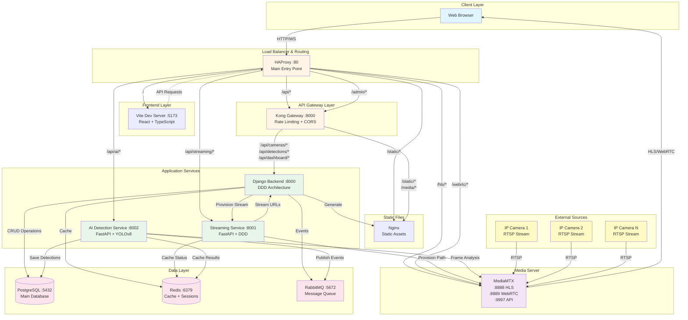

# VMS — Complete Architecture Overview

## System Architecture Diagram

## Component Responsibilities

### 1. HAProxy (Port 80)
- **Role**: Main entry point and intelligent router
- **Responsibilities**:
  - Route frontend requests to Vite
  - Route API requests to Kong Gateway
  - Route HLS/WebRTC directly to MediaMTX (bypass gateway for performance)
  - Route streaming API to Streaming Service
  - Route AI API to AI Detection Service
  - Serve static files via Nginx

### 2. Kong Gateway (Port 8000)
- **Role**: API Gateway with security and rate limiting
- **Responsibilities**:
  - Rate limiting (100 req/min for API, 500 req/min for streaming)
  - CORS handling
  - Route /api/* to Django Backend
  - Route /admin/* to Django Backend
  - Metrics collection (Prometheus)

### 3. Django Backend (Port 8000)
- **Role**: Main business logic and data management
- **Architecture**: Domain-Driven Design (DDD)
- **Responsibilities**:
  - Camera CRUD operations
  - User authentication (JWT)
  - Detection management
  - Dashboard statistics
  - **Provision streams** via Streaming Service when camera is created
  - Clips management
  - Mosaico (multi-camera view) management

### 4. Streaming Service (Port 8001)
- **Role**: Stream lifecycle management
- **Architecture**: FastAPI + DDD
- **Responsibilities**:
  - Provision camera paths in MediaMTX via API
  - Manage on-demand streaming
  - Monitor stream status
  - Generate HLS URLs
  - Cache stream metadata in Redis

### 5. AI Detection Service (Port 8002)
- **Role**: Real-time video analysis
- **Architecture**: FastAPI + YOLOv8
- **Responsibilities**:
  - License plate detection (ALPR)
  - Vehicle detection and classification
  - Process 1 frame per second (economic mode)
  - Save detections to PostgreSQL
  - Publish events to RabbitMQ
  - Respect ROI (Region of Interest) configurations

### 6. MediaMTX
- **Role**: Media server for RTSP to HLS/WebRTC conversion
- **Ports**:
  - 8888: HLS streaming
  - 8889: WebRTC streaming
  - 9997: Control API
  - 8554: RTSP input
- **Responsibilities**:
  - Accept RTSP streams from IP cameras
  - Convert to HLS (HTTP Live Streaming)
  - Convert to WebRTC (low latency)
  - On-demand streaming (only connects when viewers present)
  - Dynamic path provisioning via API

### 7. PostgreSQL (Port 5432)
- **Role**: Primary data store
- **Stores**:
  - Users and authentication
  - Cameras configuration
  - Detections (AI results)
  - Clips metadata
  - Mosaicos configuration
  - Dashboard statistics

### 8. Redis (Port 6379)
- **Role**: Cache and session store
- **Databases**:
  - DB 0: Django sessions
  - DB 1: General cache
  - DB 2: Streaming service cache
  - DB 3: AI detection cache

### 9. RabbitMQ (Port 5672)
- **Role**: Message broker for async communication
- **Queues**:
  - AI detection events
  - Camera status changes
  - System notifications

## Data Flow Examples

### Camera Creation Flow
1. User creates camera in Frontend
2. Frontend → HAProxy → Kong → Backend
3. Backend saves camera to PostgreSQL
4. Backend calls Streaming Service to provision
5. Streaming Service calls MediaMTX API to add path
6. MediaMTX ready to accept RTSP from camera
7. Frontend receives success response

### Live View Flow
1. User opens camera view in Frontend
2. Frontend requests HLS URL: `/hls/cam_{id}/index.m3u8`
3. HAProxy routes directly to MediaMTX (port 8888)
4. MediaMTX connects to camera RTSP (on-demand)
5. MediaMTX transcodes to HLS segments
6. Browser plays HLS stream via HLS.js

### AI Detection Flow
1. AI Service polls MediaMTX for active streams
2. Extracts 1 frame per second from HLS
3. Runs YOLOv8 inference on frame
4. Detects license plates and vehicles
5. Saves detection to PostgreSQL
6. Publishes event to RabbitMQ
7. Frontend receives real-time notification

## Technology Stack

### Frontend
- React 18 + TypeScript
- Vite (dev server)
- TanStack Query (data fetching)
- Zustand (state management)
- Tailwind CSS + shadcn/ui
- HLS.js (video playback)

### Backend
- Django 5.1 + DRF
- PostgreSQL 15
- Redis 7
- Celery (async tasks)
- JWT authentication
- DDD architecture

### Services
- FastAPI (Streaming + AI)
- YOLOv8 (license plate detection)
- MediaMTX (media server)
- FFmpeg (video processing)

### Infrastructure
- Docker + Docker Compose
- HAProxy (load balancer)
- Kong (API gateway)
- Nginx (static files)
- RabbitMQ (message queue)

## Deployment Configuration

### Resource Limits (MVP)
- **AI Detection**: 2 CPU, 3GB RAM
- **Streaming**: 1.5 CPU, 1GB RAM
- **Backend**: 0.5 CPU, 1GB RAM
- **MediaMTX**: 2.5 CPU, unlimited RAM

### Network
- All services in `gtvision_network` bridge
- Only HAProxy exposed on port 80
- Internal service communication via Docker DNS

### Volumes
- `gtvision_pg_data`: PostgreSQL data
- `rabbitmq_data`: RabbitMQ data
- `backend_static`: Django static files
- `backend_media`: User uploads
- `mediamtx_recordings`: Video recordings (read-only for backend)

## Security Features

1. **Authentication**: JWT tokens with refresh
2. **Rate Limiting**: Kong enforces API limits
3. **CORS**: Configured for localhost:5173 (dev)
4. **MediaMTX Auth**: API protected with credentials
5. **Network Isolation**: Services not exposed externally
6. **Input Validation**: Pydantic models in FastAPI, DRF serializers in Django

## Performance Optimizations

1. **On-Demand Streaming**: MediaMTX only connects when viewers present
2. **HLS Caching**: 6 segments, 4s duration
3. **AI Economic Mode**: 1 FPS processing
4. **Redis Caching**: Stream status and metadata
5. **Connection Pooling**: PostgreSQL and Redis
6. **Static File Serving**: Nginx for efficient delivery

## Monitoring & Observability

1. **HAProxy Stats**: http://localhost:8404/stats
2. **Kong Metrics**: Prometheus plugin enabled
3. **MediaMTX Metrics**: Port 9998
4. **Health Checks**: All services have /health endpoints
5. **Logs**: Centralized stdout logging

## Scalability Considerations (MVP Limits)

- **Max 4 cameras per mosaic**
- **Max 4 concurrent users per unit**
- **On-demand streaming** (not continuous)
- **AI at 1 FPS** (economic mode)
- **No playback/recording** in MVP phase

These limits ensure stable operation and predictable resource usage.
