# VMS — Streaming Live View Architecture

## Complete Live View Flow


## Component Details

### 1. Frontend Video Player (StreamThumbnail.tsx)

```typescript
// HLS.js configuration for optimal streaming
const hls = new Hls({
  enableWorker: false,
  lowLatencyMode: false,
  maxBufferLength: 5,        // 5 seconds buffer
  maxBufferSize: 5 * 1000 * 1000  // 5MB
})

// Generate HLS URL
const hlsUrl = `/hls/cam_${cameraId}/index.m3u8`

// Load and play
hls.loadSource(hlsUrl)
hls.attachMedia(videoElement)
video.play()
```

**Key Features**:
- Automatic error recovery
- Fallback to snapshot on failure
- Online/offline status indicator
- Thumbnail preview mode

### 2. HAProxy Routing (haproxy.cfg)

```
# HLS routing - HIGHEST PRIORITY
acl is_hls path_beg /hls/

use_backend mediamtx_hls if is_hls

backend mediamtx_hls
    mode http
    http-request replace-path /hls/(.*) /\1
    server mediamtx1 mediamtx:8888 check
```

**Why Direct Routing?**:
- **Low Latency**: Bypass Kong gateway overhead
- **High Throughput**: No rate limiting on video segments
- **Simplicity**: Direct path to media server
- **Performance**: Reduce hops in critical path

### 3. MediaMTX Configuration (mediamtx.yml)

```yaml
# HLS Server Configuration
hls: yes
hlsAddress: :8888
hlsAllowOrigins: ['*']
hlsAlwaysRemux: no
hlsVariant: fmp4              # Fragmented MP4 (modern)
hlsSegmentCount: 6            # Keep 6 segments in playlist
hlsSegmentDuration: 4s        # 4 second segments
hlsSegmentMaxSize: 50M        # Max segment size
hlsMuxerCloseAfter: 30s       # Close after 30s no viewers
hlsPartDuration: 1s           # Low latency parts

# Path Defaults
pathDefaults:
  sourceOnDemand: yes                    # Only connect when needed
  sourceOnDemandStartTimeout: 10s        # Max time to connect
  sourceOnDemandCloseAfter: 15s          # Close after no viewers
  maxReaders: 8                          # Max concurrent viewers per stream
  record: no                             # No recording (MVP)
```

**On-Demand Behavior**:
1. Path exists but not connected
2. First viewer requests manifest
3. MediaMTX connects to RTSP source
4. Starts transcoding to HLS
5. Serves segments to all viewers
6. Last viewer leaves → wait 30s → disconnect

### 4. Stream Provisioning Flow


## HLS Streaming Protocol

### HLS Playlist Structure

**Master Playlist** (`index.m3u8`):
```
#EXTM3U
#EXT-X-VERSION:9
#EXT-X-INDEPENDENT-SEGMENTS

#EXT-X-STREAM-INF:BANDWIDTH=2000000,CODECS="avc1.64001f,mp4a.40.2"
stream.m3u8
```

**Media Playlist** (`stream.m3u8`):
```
#EXTM3U
#EXT-X-VERSION:9
#EXT-X-TARGETDURATION:4
#EXT-X-MEDIA-SEQUENCE:123

#EXTINF:4.000,
seg_123.mp4
#EXTINF:4.000,
seg_124.mp4
#EXTINF:4.000,
seg_125.mp4
#EXTINF:4.000,
seg_126.mp4
#EXTINF:4.000,
seg_127.mp4
#EXTINF:4.000,
seg_128.mp4
```

### Segment Lifecycle

```
Camera RTSP Stream
    ↓
MediaMTX Buffer (continuous)
    ↓
Segmenter (every 4s)
    ↓
seg_N.mp4 (fMP4 format)
    ↓
Playlist Update (index.m3u8)
    ↓
Browser HLS.js Player
    ↓
Video Element Playback
```

## Performance Characteristics

### Latency Breakdown

| Component | Latency | Notes |
|-----------|---------|-------|
| Camera → MediaMTX | 100-500ms | RTSP network delay |
| MediaMTX Buffering | 4s | Segment duration |
| HAProxy Routing | <10ms | Minimal overhead |
| Network Transfer | 50-200ms | Depends on bandwidth |
| HLS.js Buffering | 5s | Client-side buffer |
| **Total Latency** | **~10-15s** | Acceptable for monitoring |

### Bandwidth Usage (per stream)

| Quality | Resolution | Bitrate | Bandwidth |
|---------|-----------|---------|-----------|
| Low | 640x480 | 500 Kbps | 0.5 Mbps |
| Medium | 1280x720 | 1.5 Mbps | 1.5 Mbps |
| High | 1920x1080 | 3 Mbps | 3 Mbps |

**4 Cameras Simultaneously**: 2-12 Mbps total

### Resource Usage (MediaMTX)

- **CPU**: ~5-10% per active stream
- **Memory**: ~50-100MB per stream
- **Disk I/O**: Minimal (no recording in MVP)
- **Network**: Input RTSP + Output HLS

## Error Handling

### Common Scenarios

#### 1. Camera Offline
```
User → MediaMTX: GET /hls/cam_2/index.m3u8
MediaMTX → Camera: RTSP DESCRIBE (timeout)
MediaMTX → User: 404 Not Found
Frontend: Display "Offline" status
```

#### 2. Stream Not Provisioned
```
User → MediaMTX: GET /hls/cam_99/index.m3u8
MediaMTX: Path not found in config
MediaMTX → User: 404 Not Found
Frontend: Display "Camera not configured"
```

#### 3. Network Interruption
```
Camera → MediaMTX: Connection lost
MediaMTX: Buffer depletes
MediaMTX → Viewers: Stop serving segments
HLS.js: Retry mechanism (3 attempts)
HLS.js: Fire error event
Frontend: Show reconnection message
```

#### 4. Too Many Viewers
```
9th Viewer → MediaMTX: Request stream
MediaMTX: maxReaders = 8 exceeded
MediaMTX → Viewer: 503 Service Unavailable
Frontend: Display "Stream at capacity"
```

## Optimization Strategies

### 1. Segment Duration Trade-offs

**Shorter Segments (1-2s)**:
- ✅ Lower latency
- ❌ Higher CPU usage
- ❌ More HTTP requests
- ❌ Higher overhead

**Longer Segments (4-6s)**:
- ✅ Lower CPU usage
- ✅ Fewer HTTP requests
- ✅ Better for multiple streams
- ❌ Higher latency

**MVP Choice**: 4s segments (balanced)

### 2. On-Demand vs Always-On

**On-Demand (MVP)**:
- ✅ Saves bandwidth when not viewing
- ✅ Reduces camera load
- ✅ Lower resource usage
- ❌ 10s startup delay

**Always-On**:
- ✅ Instant playback
- ❌ Continuous bandwidth usage
- ❌ Higher resource usage
- ❌ Camera always streaming

### 3. Codec Selection

**H.264 (Current)**:
- ✅ Universal browser support
- ✅ Hardware acceleration
- ✅ Good quality/size ratio
- ❌ Licensing considerations

**H.265/HEVC**:
- ✅ Better compression
- ❌ Limited browser support
- ❌ Higher CPU for transcoding

## Multi-Camera Viewing (Mosaic)

```mermaid
graph LR
    subgraph "Browser"
        Player1[HLS Player 1]
        Player2[HLS Player 2]
        Player3[HLS Player 3]
        Player4[HLS Player 4]
    end

    subgraph "MediaMTX"
        Stream1[cam_1 HLS]
        Stream2[cam_2 HLS]
        Stream3[cam_3 HLS]
        Stream4[cam_4 HLS]
    end

    Player1 -->|/hls/cam_1/*| Stream1
    Player2 -->|/hls/cam_2/*| Stream2
    Player3 -->|/hls/cam_3/*| Stream3
    Player4 -->|/hls/cam_4/*| Stream4

    Stream1 --> Cam1[📹 Camera 1]
    Stream2 --> Cam2[📹 Camera 2]
    Stream3 --> Cam3[📹 Camera 3]
    Stream4 --> Cam4[📹 Camera 4]
```



**Resource Impact**:
- 4 independent HLS.js instances
- 4 separate RTSP connections
- 4x bandwidth usage
- Synchronized playback not guaranteed

**MVP Limit**: Max 4 cameras per mosaic to ensure performance

## Monitoring & Debugging

### Check Stream Status

```bash
# MediaMTX API - List active paths
curl http://localhost:9997/v3/paths/list

# Check specific path
curl http://localhost:9997/v3/paths/get/cam_2

# HAProxy stats
http://localhost:8404/stats
```

### Common Issues

1. **404 on HLS**: Stream not provisioned → Check Streaming Service
2. **Infinite Loading**: Camera offline → Check RTSP connectivity
3. **Stuttering Playback**: Bandwidth issue → Reduce quality
4. **High CPU**: Too many streams → Limit concurrent viewers

## Future Enhancements (Post-MVP)

1. **Adaptive Bitrate**: Multiple quality levels
2. **WebRTC**: Lower latency (<1s)
3. **Recording**: DVR functionality
4. **Playback**: Timeline scrubbing
5. **Thumbnails**: Preview generation
6. **Multi-bitrate**: Quality selection
