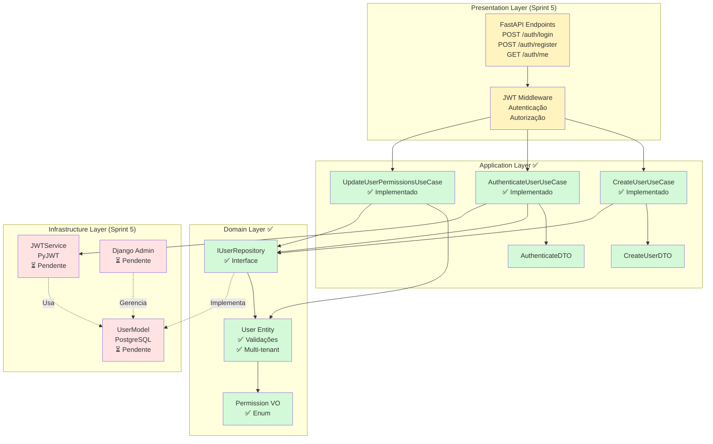
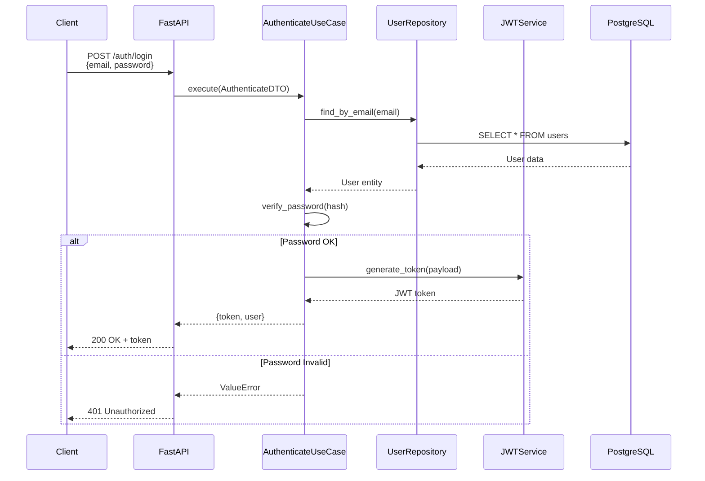
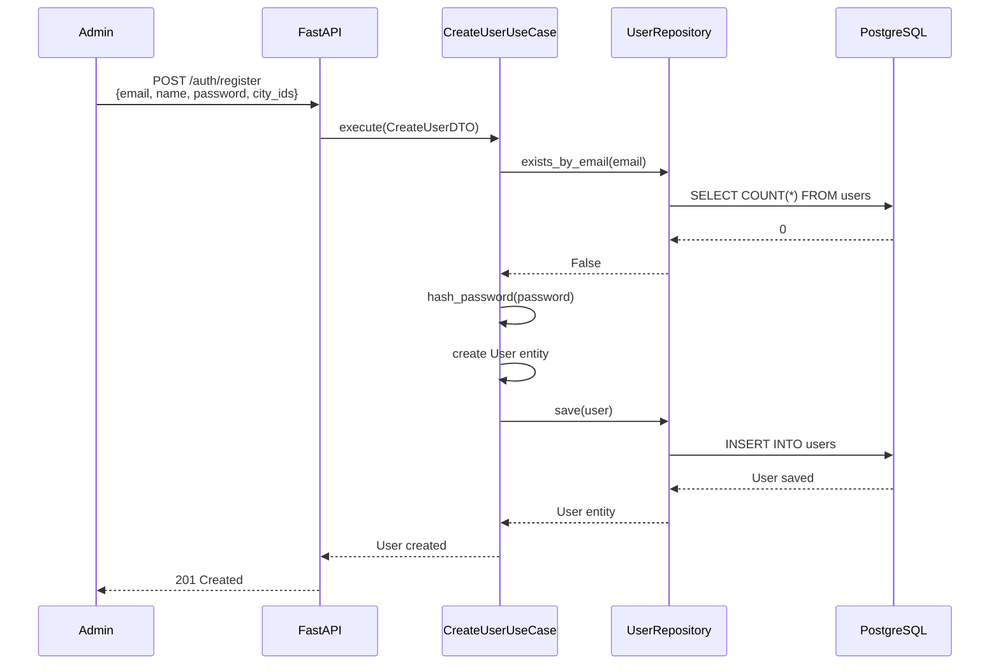
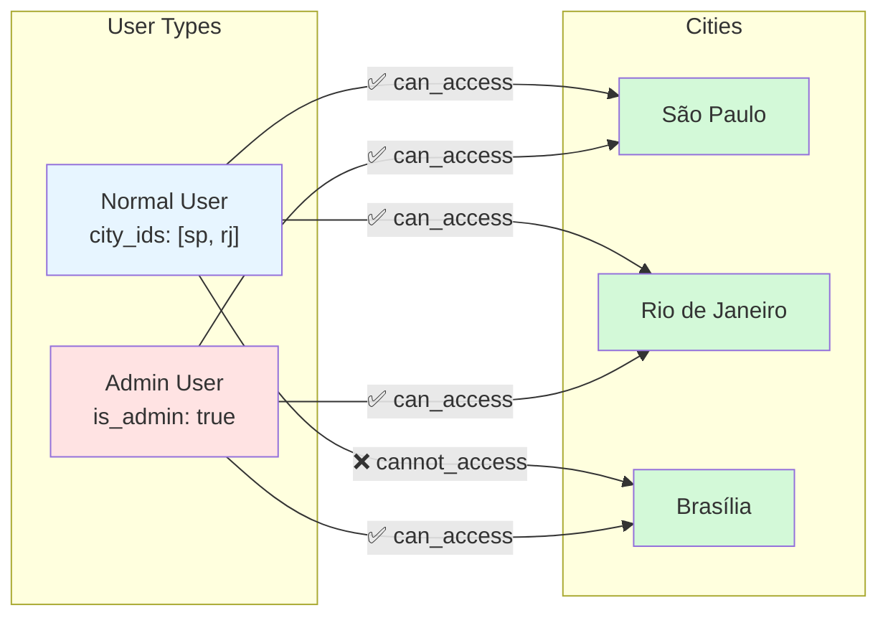
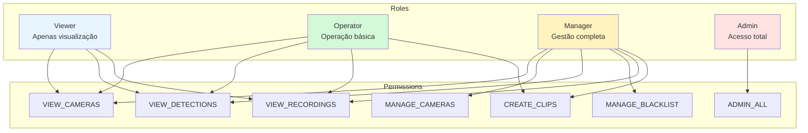
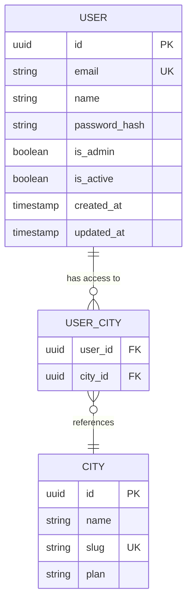
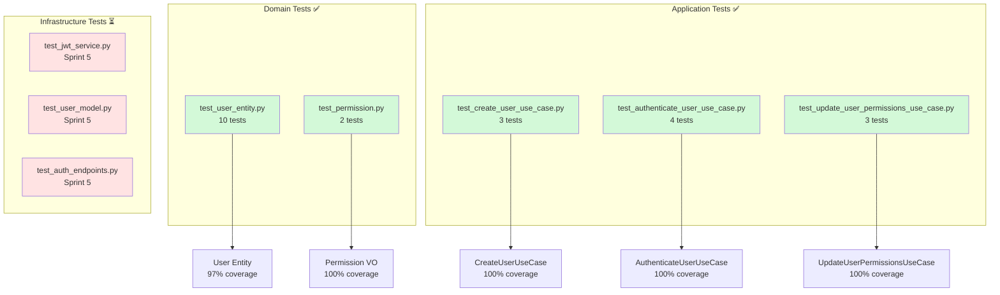
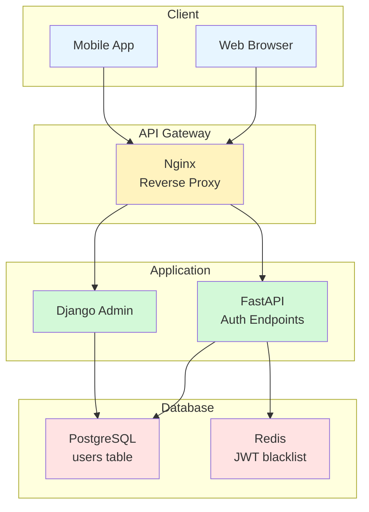

# 🏗️ Admin Module - Architecture Diagram

## System Overview

## Authentication Flow

## User Creation Flow

## Multi-Tenant Access Control

## Permission System

## Data Model

## Test Coverage Map

## Deployment Architecture (Sprint 5)

---

## Legend

- 🟢 **Green** - Implementado (Sprint 4)
- 🟡 **Yellow** - Em desenvolvimento
- 🔴 **Red** - Pendente (Sprint 5)
- ✅ **Check** - Completo
- ⏳ **Clock** - Aguardando

---

## Notes

1. **Domain + Application** estão 100% implementados e testados
2. **Infrastructure** será implementado na Sprint 5
3. **JWT** usará PyJWT com RS256
4. **PostgreSQL** armazenará usuários no banco default
5. **Redis** será usado para blacklist de tokens
